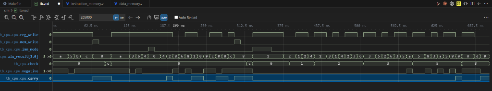
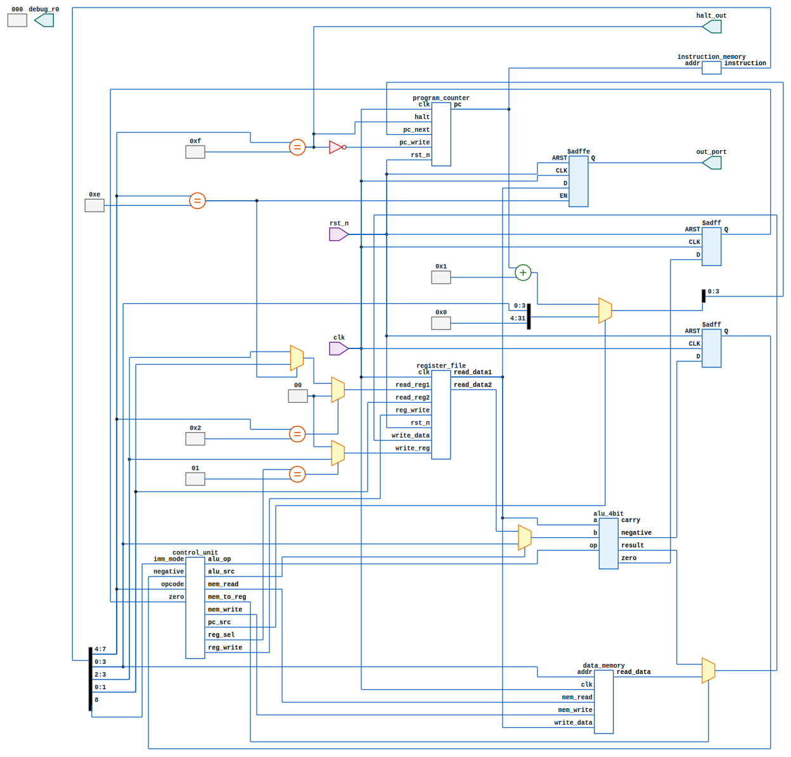
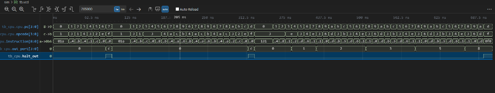
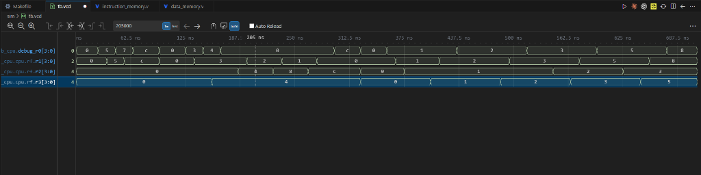
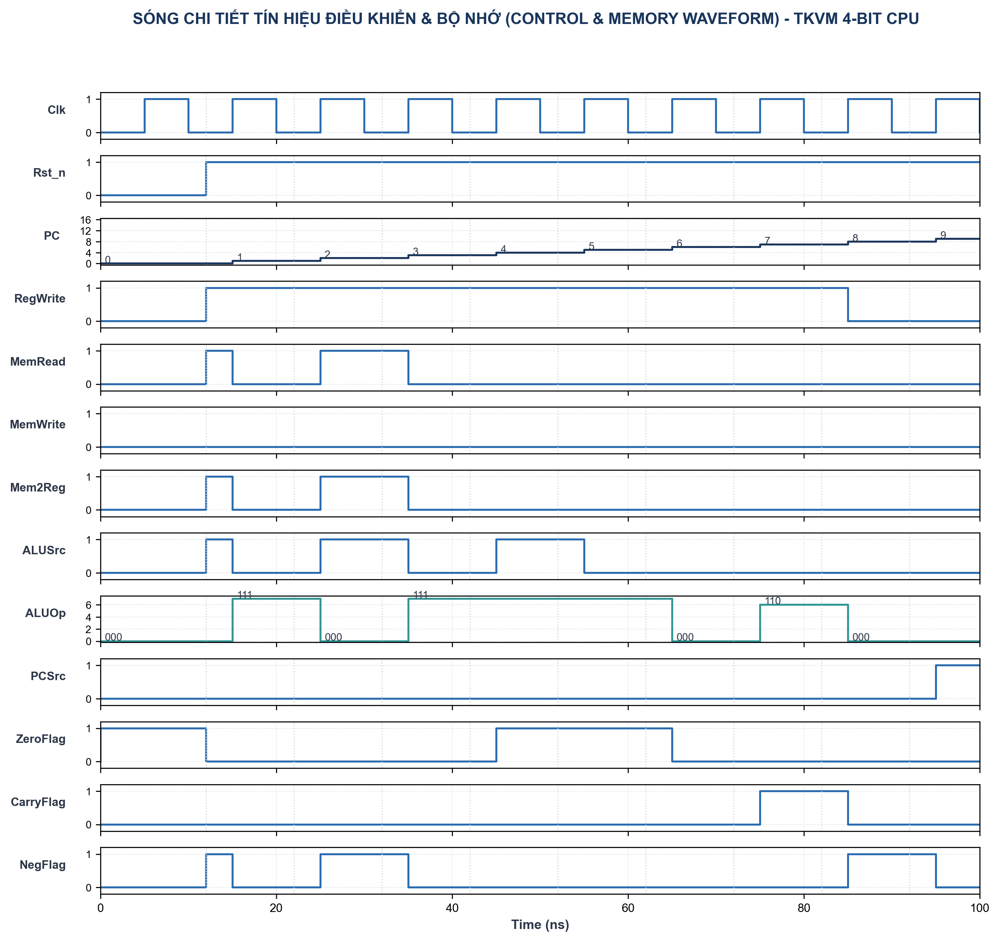
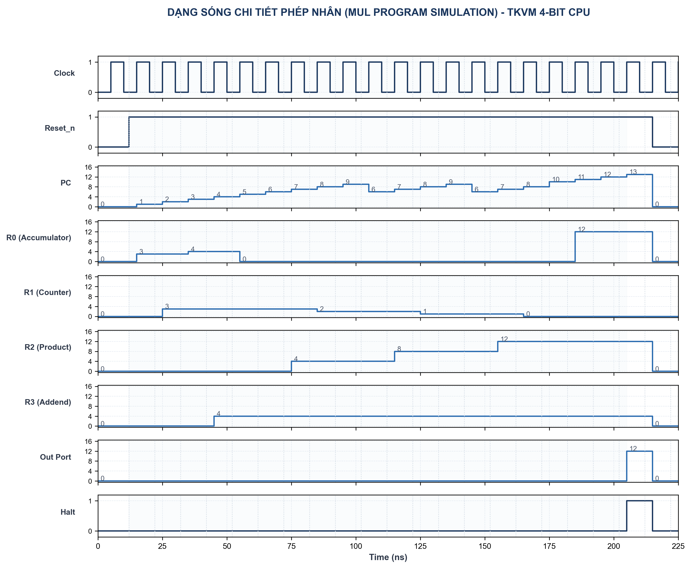
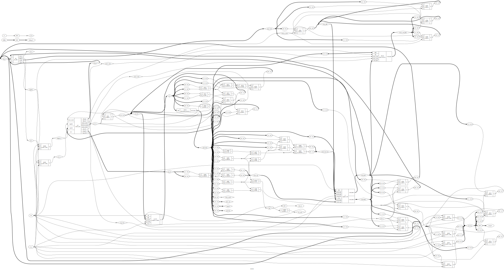
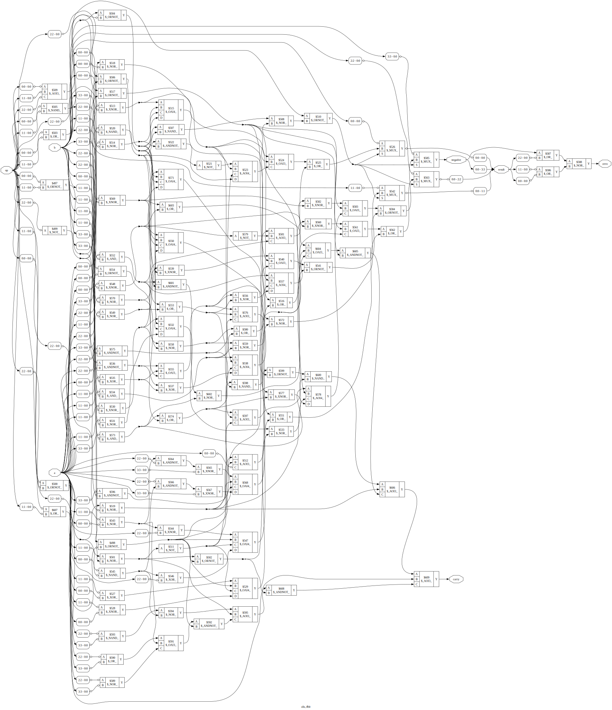
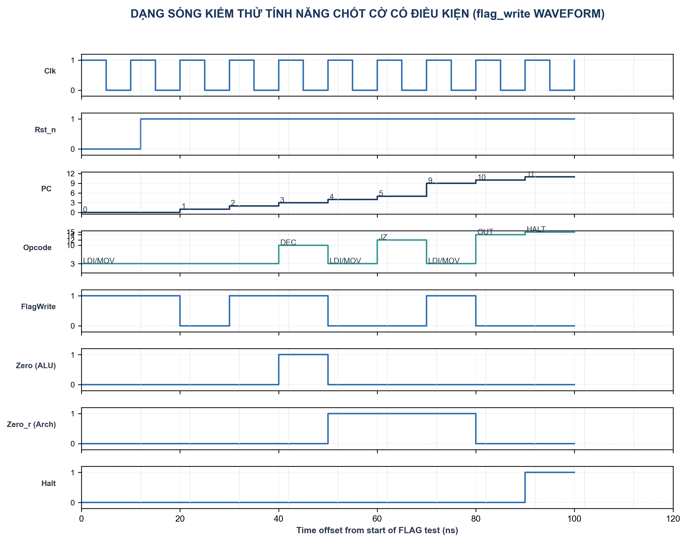

# TRƯỜNG ĐẠI HỌC KHOA HỌC TỰ NHIÊN - ĐHQG-HCM
## KHOA VẬT LÝ - VẬT LÝ KỸ THUẬT
### BỘ MÔN VẬT LÝ TIN HỌC / THIẾT KẾ VI MẠCH

<div align="center">
  
</div>

---

# BÁO CÁO ĐỒ ÁN MÔN HỌC: THIẾT KẾ VI MẠCH ĐIỆN TỬ
## ĐỀ TÀI: THIẾT KẾ VÀ KIỂM THỬ BỘ VI XỬ LÝ CPU 4-BIT ĐƠN CHU KỲ (TKVM)
### KIẾN TRÚC HARVARD — RTL SIMULATION & PHYSICAL LAYOUT (GDSII)

* **Sinh viên thực hiện:** Lê Ngọc Tường
* **Mã số sinh viên:** 22120395
* **Lớp:** Thiết kế vi mạch điện tử - Học kỳ 3 / 2025-2026
* **Giáo viên hướng dẫn:** Ban Giảng huấn Bộ môn Vi mạch

---

## MỤC LỤC

1. [Chương 1: Tổng quan kiến trúc hệ thống](#1-tong-quan)
2. [Chương 2: Kiến trúc tập lệnh (ISA) & Bộ điều khiển](#2-isa)
3. [Chương 3: Thiết kế phần cứng cấp RTL](#3-rtl-design)
4. [Chương 4: Mô phỏng RTL & Kiểm thử chức năng](#4-simulation)
5. [Chương 5: Logic Synthesis & Thống kê tài nguyên](#5-synthesis)
6. [Chương 6: Báo cáo định thời & Phân tích đường trễ tới hạn](#6-timing)
7. [Chương 7: Tích hợp cơ chế chốt cờ điều khiển (flag_write)](#7-improvement)
8. [Chương 8: Kiểm chứng chức năng & Thực nghiệm](#8-verification)
9. [Kết luận](#9-conclusion)

---

## DANH MỤC HÌNH VẼ

* **Hình 1:** Sơ đồ khối tổng quan kiến trúc CPU 4-bit (Harvard Architecture)
* **Hình 2:** Dạng sóng mô phỏng tổng quan chạy chuỗi 3 chương trình (waveform_overview)
* **Hình 3:** Dạng sóng hoạt động của tập thanh ghi R0 - R3 (waveform_registers)
* **Hình 4:** Dạng sóng các tín hiệu điều khiển và kết quả ALU (waveform_control)
* **Hình 5:** Dạng sóng chi tiết thực thi phép nhân 3 × 4 = 12 (waveform_cpu_top)
* **Hình 6:** Sơ đồ netlist mức cổng (Gate-level Netlist) toàn CPU do Yosys tổng hợp
* **Hình 7:** Sơ đồ netlist mức cổng chi tiết của khối tính toán ALU 4-bit
* **Hình 8:** Layout vật lý GDSII của CPU hiển thị trên KLayout sau quy trình OpenLane
* **Hình 9:** Dạng sóng mô phỏng kiểm thử cờ có điều kiện (waveform_flag)

---

## DANH MỤC BẢNG BIỂU

* **Bảng 1:** Bảng mô tả ngữ nghĩa tập lệnh (ISA Semantics)
* **Bảng 2:** Bảng chân trị giải mã tín hiệu điều khiển tích hợp flag_write
* **Bảng 3:** Phạm vi kiểm thử và phân tầng của các tệp VCD mô phỏng
* **Bảng 4:** Bảng trace hoạt động chu kỳ thực thi chương trình nhân (MUL)
* **Bảng 5:** Kịch bản kiểm thử tối thiểu và kết quả kiểm chứng chức năng

---

<a name="1-tong-quan"></a>
## Chương 1: Tổng quan kiến trúc hệ thống

Dự án này hiện thực hóa một bộ vi xử lý (CPU) 4-bit đơn chu kỳ (single-cycle) theo kiến trúc Harvard phục vụ môn học Thiết kế vi mạch điện tử. Thiết kế này phân tách độc lập giữa bộ nhớ chứa chương trình (ROM) và bộ nhớ chứa dữ liệu (RAM) để đạt hiệu năng xử lý cao, tránh nghẽn cổ chai bus dữ liệu truyền thống.

### 1.1. Thông số kỹ thuật cốt lõi
* **Độ rộng từ lệnh (Instruction Word):** 9 bit. Cấu trúc lệnh bao gồm bit chế độ hằng số `imm_mode` [8], mã lệnh `opcode` [7:4], và toán hạng `operand` [3:0].
* **Độ rộng bus dữ liệu (Data Bus):** 4 bit.
* **Tập thanh ghi (Register File):** Gồm 4 thanh ghi đa dụng từ R0 đến R3 (4 bit mỗi thanh ghi). Trong đó, thanh ghi R0 đóng vai trò thanh ghi tích lũy (accumulator) ngầm định cho các lệnh truy cập bộ nhớ (`LOAD`, `STORE`) và nạp hằng số (`LDI`).
* **Bộ nhớ chỉ lệnh (Instruction ROM):** Kích thước 16 từ lệnh × 9 bit.
* **Bộ nhớ dữ liệu (Data RAM):** Kích thước 16 ô nhớ × 4 bit.
* **Thanh ghi trạng thái (Flags Register):** Lấy mẫu và chốt 2 cờ trạng thái gồm cờ Zero (Z), cờ âm Negative (N) tại cạnh lên của xung nhịp (clock edge). Các cờ này được chốt có điều kiện nhờ tín hiệu điều khiển `flag_write` để đảm bảo lệnh nhảy điều kiện đọc đúng trạng thái từ phép toán arithmetic/logic liền trước mà không bị ghi đè bởi các lệnh không liên quan.
* **Chu kỳ thực thi:** Đơn chu kỳ (Single-cycle), mỗi lệnh hoàn thành trong đúng một chu kỳ xung nhịp.
* **Tín hiệu điều khiển đặc biệt:** `HALT` (khi tích cực sẽ khóa bộ đếm chương trình PC để dừng hệ thống).

---

<a name="2-isa"></a>
## Chương 2: Kiến trúc tập lệnh (ISA) & Bộ điều khiển

Bộ vi xử lý hoạt động dựa trên định dạng từ lệnh có độ rộng cố định là **9 bit**. Cấu trúc từ lệnh được mô tả như sau:

```text
 8             7             4 3             0
+---------------+---------------+---------------+
|   imm_mode    |    opcode     |    operand    |
|    (1 bit)    |   (4 bit)     |    (4 bit)    |
+---------------+---------------+---------------+
```

*   `imm_mode` (bit [8]): Chỉ có ý nghĩa phân biệt chế độ hoạt động khi `opcode = 0011` (giá trị `1` chọn lệnh nạp hằng số `LDI`, giá trị `0` chọn lệnh sao chép thanh ghi `MOV`). Đối với các opcode khác, cách diễn giải operand được quyết định bởi opcode; `imm_mode` là bit không sử dụng và được assembler mặc định gán về `0`.
*   `opcode` (bit [7:4]): Có 16 giá trị mã hóa từ `0000` đến `1111`. Riêng opcode `0011` kết hợp với `imm_mode` để phân biệt lệnh `LDI` và `MOV`.
*   `operand` (bit [3:0]): Toán hạng phụ thuộc vào từng lệnh.

### 2.1. Giải pháp mã hóa lệnh bằng tổ hợp `{imm_mode, opcode}`
Để tối ưu hóa không gian mã hóa opcode 4-bit, thiết kế sử dụng chung mã opcode `0011` cho hai lệnh `LDI` và `MOV`. Bộ giải mã điều khiển giải quyết trùng chấp bằng cách kết hợp cả bit `imm_mode`:
*   Khi `{imm_mode, opcode} = 5'b1_0011`: Giải mã là lệnh `LDI`, toán hạng 4-bit `operand[3:0]` được đưa qua ALU và ghi vào thanh ghi tích lũy $R_0$.
*   Khi `{imm_mode, opcode} = 5'b0_0011`: Giải mã là lệnh `MOV`, toán hạng được chia thành thanh ghi đích $R_d$ (`operand[3:2]`) và thanh ghi nguồn $R_s$ (`operand[1:0]`).

### 2.2. Bảng mô tả ngữ nghĩa tập lệnh (ISA Semantics)

Dưới đây là đặc tả ngữ nghĩa hoạt động của các lệnh cùng hành vi cờ tương ứng đối với phiên bản phần cứng hiện tại (khi cờ trạng thái được chốt có điều kiện qua `flag_write` ở mỗi chu kỳ clock):

**Bảng 1:** Bảng mô tả ngữ nghĩa tập lệnh (ISA Semantics)
| Opcode | Lệnh | Định dạng ASM | Phép toán mức RTL (Register Transfer Level) | Hành vi cờ của RTL hiện tại |
| :---: | :--- | :--- | :--- | :--- |
| `0000` | NOP | `NOP` | Không thao tác | Giữ nguyên trạng thái cờ trước đó |
| `0001` | LOAD | `LOAD addr` | $R_0 \leftarrow \text{RAM}[\text{addr}]$ | Giữ nguyên trạng thái cờ trước đó |
| `0010` | STORE | `STORE addr` | $\text{RAM}[\text{addr}] \leftarrow R_0$ | Giữ nguyên trạng thái cờ trước đó |
| `0011` | MOV | `MOV Rd, Rs` | $R[R_d] \leftarrow R[R_s]$ | Giữ nguyên trạng thái cờ trước đó |
| `0011` | LDI | `LDI #imm` | $R_0 \leftarrow \text{imm\_val}$ | $Z, N$ phản ánh giá trị hằng số nạp |
| `0100` | ADD | `ADD Rd, Rs` | $R[R_d] \leftarrow R[R_d] + R[R_s]$ | $Z, N$ phản ánh kết quả phép cộng |
| `0101` | SUB | `SUB Rd, Rs` | $R[R_d] \leftarrow R[R_d] - R[R_s]$ | $Z, N$ phản ánh kết quả phép trừ |
| `0110` | AND | `AND Rd, Rs` | $R[R_d] \leftarrow R[R_d] \ \& \ R[R_s]$ | $Z, N$ phản ánh kết quả phép AND |
| `0111` | OR | `OR Rd, Rs` | $R[R_d] \leftarrow R[R_d] \ | \ R[R_s]$ | $Z, N$ phản ánh kết quả phép OR |
| `1000` | XOR | `XOR Rd, Rs` | $R[R_d] \leftarrow R[R_d] \oplus R[R_s]$ | $Z, N$ phản ánh kết quả phép XOR |
| `1001` | INC | `INC Rd` | $R[R_d] \leftarrow R[R_d] + 1$ | $Z, N$ phản ánh kết quả phép tăng |
| `1010` | DEC | `DEC Rd` | $R[R_d] \leftarrow R[R_d] - 1$ | $Z, N$ phản ánh kết quả phép giảm |
| `1011` | JMP | `JMP addr` | $\text{PC} \leftarrow \text{addr}$ | Giữ nguyên trạng thái cờ trước đó |
| `1100` | JZ | `JZ addr` | $\text{if } Z = 1: \text{PC} \leftarrow \text{addr}$ | Giữ nguyên trạng thái cờ trước đó |
| `1101` | JN | `JN addr` | $\text{if } N = 1: \text{PC} \leftarrow \text{addr}$ | Giữ nguyên trạng thái cờ trước đó |
| `1110` | OUT | `OUT Rs` | $\text{OUT} \leftarrow R[R_s]$ | Giữ nguyên trạng thái cờ trước đó |
| `1111` | HALT | `HALT` | Đóng băng bộ đếm chương trình PC | Giữ nguyên trạng thái cờ trước đó |

> [!NOTE]
> **Giải thích tính bất đối xứng về hành vi cờ giữa LDI và LOAD:**
> Lệnh `LDI #imm` thực hiện cập nhật cờ trạng thái ($Z, N$), trong khi lệnh `LOAD addr` (đọc dữ liệu từ RAM ghi vào R0) thì giữ nguyên trạng thái cờ trước đó. Đây là một quyết định thiết kế kiến trúc có chủ đích để tối ưu hóa phần cứng:
> 1. **Tối ưu hóa đường trễ tới hạn (Critical Path):** Thao tác đọc dữ liệu từ RAM của lệnh `LOAD` là mạch tổ hợp bất đồng bộ diễn ra ở nửa sau chu kỳ xung nhịp và có độ trễ truy xuất lớn. Nếu cho phép dữ liệu đọc từ RAM đi qua khối ALU để sinh cờ trạng thái và chốt lại tại cạnh lên clock, đường trễ tới hạn sẽ bị kéo dài cực hạn (bao gồm trễ đọc RAM + trễ ALU + trễ setup cờ). Điều này sẽ làm giảm đáng kể tần số hoạt động cực đại $F_{max}$ của toàn CPU.
> 2. **Giải pháp phân tách:** Việc không cập nhật cờ khi `LOAD` giúp rút ngắn critical path tối đa. Nếu lập trình viên muốn kiểm tra trạng thái của dữ liệu vừa nạp từ RAM, họ có thể sử dụng một lệnh ALU bổ sung (như `AND R0, R0` hoặc `ADD R0, #0`) để cập nhật cờ một cách an toàn mà không làm ảnh hưởng đến tần số nhịp hệ thống.

### 2.3. Bảng chân trị giải mã tín hiệu (Control Decoding)
Dựa vào mã opcode và bit `imm_mode`, Control Unit phát ra các tín hiệu điều khiển tương ứng để cấu hình ALU, các bộ dồn kênh (Multiplexer), và kích hoạt cập nhật cờ trạng thái thông qua tín hiệu `flag_write`:

**Bảng 2:** Bảng chân trị giải mã tín hiệu điều khiển tích hợp flag_write
| Opcode | Lệnh | imm_mode | RegWrite | MemRead | MemWrite | MemToReg | ALUSrc | ALUOp | PCSrc | flag_write | Ghi chú |
| :--- | :--- | :---: | :---: | :---: | :---: | :---: | :---: | :---: | :---: | :---: | :--- |
| `0000` | NOP | X | 0 | 0 | 0 | 0 | 0 | `000` | 0 | 0 | Không thao tác |
| `0001` | LOAD | X | 1 | 1 | 0 | 1 | 1 | `000` | 0 | 0 | Nạp R0 = RAM[addr] |
| `0010` | STORE | X | 0 | 0 | 1 | X | 1 | `000` | 0 | 0 | Ghi RAM[addr] = R0 |
| `0011` | LDI | 1 | 1 | 0 | 0 | 0 | 1 | `111` | 0 | 1 | Nạp R0 = imm |
| `0011` | MOV | 0 | 1 | 0 | 0 | 0 | 0 | `111` | 0 | 0 | Sao chép Rd = Rs |
| `0100` | ADD | 0 | 1 | 0 | 0 | 0 | 0 | `000` | 0 | 1 | Cộng Rd = Rd + Rs |
| `0101` | SUB | 0 | 1 | 0 | 0 | 0 | 0 | `001` | 0 | 1 | Trừ Rd = Rd - Rs |
| `0110` | AND | 0 | 1 | 0 | 0 | 0 | 0 | `010` | 0 | 1 | Logic AND Rd = Rd & Rs |
| `0111` | OR | 0 | 1 | 0 | 0 | 0 | 0 | `011` | 0 | 1 | Logic OR Rd = Rd \| Rs |
| `1000` | XOR | 0 | 1 | 0 | 0 | 0 | 0 | `100` | 0 | 1 | Logic XOR Rd = Rd ^ Rs |
| `1001` | INC | 0 | 1 | 0 | 0 | 0 | 0 | `101` | 0 | 1 | Tăng Rd = Rd + 1 |
| `1010` | DEC | 0 | 1 | 0 | 0 | 0 | 0 | `110` | 0 | 1 | Giảm Rd = Rd - 1 |
| `1011` | JMP | X | 0 | 0 | 0 | X | X | `XXX` | 1 | 0 | Nhảy PC = addr |
| `1100` | JZ | X | 0 | 0 | 0 | X | X | `XXX` | Z_r | 0 | Nhảy nếu cờ Z_r = 1 |
| `1101` | JN | X | 0 | 0 | 0 | X | X | `XXX` | N_r | 0 | Nhảy nếu cờ N_r = 1 |
| `1110` | OUT | X | 0 | 0 | 0 | X | X | `000` | 0 | 0 | Xuất out_port = Rs |
| `1111` | HALT | X | 0 | 0 | 0 | X | X | `XXX` | 0 | 0 | Dừng PC, kết thúc |

---

<a name="3-rtl-design"></a>
## Chương 3: Thiết kế phần cứng cấp RTL

Sơ đồ khối của CPU 4-bit được mô tả chi tiết trong **Hình 1**, thể hiện kết nối giữa các khối chức năng.



### 3.1. Các khối chức năng chính:
1. **Bộ đếm chương trình (Program Counter - PC):** Quản lý địa chỉ lệnh hiện tại (4 bit). PC cập nhật giá trị PC + 1 tại mỗi chu kỳ xung nhịp hoặc nạp địa chỉ mới từ toán hạng lệnh nếu có tín hiệu nhảy (`JMP`, `JZ`, `JN`) kích cực.
2. **Bộ nhớ chỉ lệnh (Instruction Memory):** Bộ nhớ ROM 16×9-bit, nhận địa chỉ từ PC để xuất ra từ lệnh rộng 9 bit tương ứng.
3. **Bộ điều khiển (Control Unit):** Đọc opcode và bit chế độ từ lệnh để sinh các tín hiệu điều khiển hệ thống (`reg_write`, `mem_write`, `mem_to_reg`, `alu_op`, `alu_src`, `flag_write`).
4. **Tập thanh ghi (Register File):** Chứa 4 thanh ghi đa dụng R0-R3. Cho phép đọc đồng thời 2 thanh ghi và ghi 1 thanh ghi tại cạnh lên xung nhịp khi tín hiệu `reg_write` tích cực.
5. **Khối tính toán Số học & Logic (ALU):** Thực hiện 8 chức năng tính toán chính trên dữ liệu 4 bit (Cộng, Trừ, AND, OR, XOR, Tăng, Giảm, Pass-through). Kết quả ALU cập nhật trạng thái các cờ trạng thái (Z, N, C) để hồi tiếp về khối điều khiển PC.
6. **Bộ nhớ dữ liệu (Data Memory):** Bộ nhớ RAM 16×4-bit dùng để lưu trữ dữ liệu tính toán, kích hoạt đọc ghi thông qua tín hiệu `mem_read` và `mem_write`.

### 3.2. Mô tả RTL phần cứng (SystemVerilog)

#### 3.2.1. Khối Số học và Logic (ALU)
Khối ALU thực hiện tính toán số học trên dữ liệu 4-bit. Để đảm bảo tính độc lập với quy tắc tự xác định độ rộng của trình biên dịch, các toán hạng cộng và trừ được mở rộng rõ ràng lên 5-bit trước khi thực hiện để trích xuất cờ nhớ `carry` tổ hợp.

```systemverilog
always_comb begin
    result = 4'b0000;
    carry  = 1'b0;

    case (op)
        3'b000: begin // ADD
            {carry, result} = {1'b0, a} + {1'b0, b};
        end
        3'b001: begin // SUB (a - b)
            // carry = 1: Không xảy ra mượn (a >= b)
            // carry = 0: Có mượn (a < b)
            {carry, result} = {1'b0, a} + {1'b0, ~b} + 5'b00001;
        end
        3'b010: result = a & b; // AND
        3'b011: result = a | b; // OR
        3'b100: result = a ^ b; // XOR
        3'b101: begin // INC
            {carry, result} = {1'b0, a} + 5'b00001;
        end
        3'b110: begin // DEC (a - 1)
            {carry, result} = {1'b0, a} + {1'b0, 4'b1111};
        end
        3'b111: result = b; // PASSTHRU (Dùng cho LDI / MOV)
        default: begin
            result = 4'b0000;
            carry  = 1'b0;
        end
    endcase
end

assign zero     = (result == 4'b0000);
assign negative = result[3]; // Bit MSB của số có dấu bù 2
```

#### 3.2.2. Khối điều khiển (Control Unit)
Bộ điều khiển giải mã mã lệnh để phát tín hiệu. Khối sử dụng cấu trúc `always_comb` để đảm bảo tính chất mạch tổ hợp và giải mã thêm cổng ra điều khiển `flag_write`:

```systemverilog
module control_unit (
    input  logic [3:0]  opcode,
    input  logic        zero,
    input  logic        negative,
    input  logic        imm_mode,
    output logic        reg_write,
    output logic        mem_read,
    output logic        mem_write,
    output logic        mem_to_reg,
    output logic        alu_src,
    output logic [2:0]  alu_op,
    output logic        pc_src,
    output logic [1:0]  reg_sel,
    output logic        flag_write
);

    always @(opcode, imm_mode) begin
        // defaults
        reg_write  = 1'b0;
        mem_read   = 1'b0;
        mem_write  = 1'b0;
        mem_to_reg = 1'b0;
        alu_src    = 1'b0;
        alu_op     = 3'b000;
        reg_sel    = 2'b00;
        flag_write = 1'b0;

        case (opcode)
            4'b0000: alu_op = 3'b000; // NOP
            4'b0001: begin // LOAD
                reg_write  = 1'b1;
                mem_read   = 1'b1;
                mem_to_reg = 1'b1;
                alu_src    = 1'b1;
                reg_sel    = 2'b00;
            end
            4'b0010: begin // STORE
                mem_write  = 1'b1;
                alu_src    = 1'b1;
            end
            4'b0011: begin // LDI / MOV
                reg_write  = 1'b1;
                mem_to_reg = 1'b0;
                alu_src    = imm_mode;
                alu_op     = 3'b111;
                reg_sel    = imm_mode ? 2'b00 : 2'b01;
                flag_write = imm_mode; // Chỉ LDI cập nhật cờ
            end
            4'b0100: begin // ADD
                reg_write  = 1'b1;
                alu_op     = 3'b000;
                reg_sel    = 2'b01;
                flag_write = 1'b1;
            end
            4'b0101: begin // SUB
                reg_write  = 1'b1;
                alu_op     = 3'b001;
                reg_sel    = 2'b01;
                flag_write = 1'b1;
            end
            4'b0110: begin // AND
                reg_write  = 1'b1;
                alu_op     = 3'b010;
                reg_sel    = 2'b01;
                flag_write = 1'b1;
            end
            4'b0111: begin // OR
                reg_write  = 1'b1;
                alu_op     = 3'b011;
                reg_sel    = 2'b01;
                flag_write = 1'b1;
            end
            4'b1000: begin // XOR
                reg_write  = 1'b1;
                alu_op     = 3'b100;
                reg_sel    = 2'b01;
                flag_write = 1'b1;
            end
            4'b1001: begin // INC
                reg_write  = 1'b1;
                alu_op     = 3'b101;
                reg_sel    = 2'b01;
                flag_write = 1'b1;
            end
            4'b1010: begin // DEC
                reg_write  = 1'b1;
                alu_op     = 3'b110;
                reg_sel    = 2'b01;
                flag_write = 1'b1;
            end
            4'b1110: alu_op = 3'b000; // OUT
            default: alu_op = 3'b000;
        endcase
    end
    
    assign pc_src = (opcode == 4'b1011) ? 1'b1 :
                    (opcode == 4'b1100) ? zero :
                    (opcode == 4'b1101) ? negative :
                    1'b0;
endmodule
```

#### 3.2.3. Khối chốt cờ trạng thái tích hợp flag_write
Để giải phóng ràng buộc phần mềm bắt buộc lệnh nhảy điều kiện phải đứng ngay sau lệnh sinh cờ, CPU tích hợp khối chốt cờ trạng thái có điều kiện trong [cpu_top.v](rtl/cpu_top.v). Các cờ Zero (`zero_r`) và Negative (`negative_r`) chỉ được cập nhật khi tín hiệu `flag_write = 1` được phát ra bởi bộ giải mã Control Unit:

```systemverilog
always_ff @(posedge clk or negedge rst_n) begin
    if (!rst_n) begin
        zero_r     <= 1'b0;
        negative_r <= 1'b0;
    end else if (flag_write) begin
        zero_r     <= zero;
        negative_r <= negative;
    end
end
```

---

<a name="4-simulation"></a>
## Chương 4: Mô phỏng RTL & Kiểm thử chức năng

Quá trình kiểm thử chức năng được phân tầng rõ rệt thông qua hai kịch bản testbench độc lập để tạo ra chuỗi bằng chứng kỹ thuật vững chắc:

**Bảng 3:** Phạm vi kiểm thử và phân tầng của các tệp VCD mô phỏng
| STT | Tệp VCD kết quả | Testbench sinh | Đối tượng kiểm thử | Nội dung kiểm thử | Phương pháp kiểm thử |
| :--- | :--- | :--- | :--- | :--- | :--- |
| 1 | `sim/tb.vcd` | `tb/tb_alu_4bit.v` | **ALU đơn lẻ** (`alu_4bit`) | Kiểm thử toàn bộ 8 phép toán số học và logic, cờ trạng thái cận biên. | Kiểm thử hộp trắng (White-box testing), kích tín hiệu ngõ vào trực tiếp. |
| 2 | `cpu_top.vcd` | `tb/tb_cpu_top.v` | **Hệ thống CPU Top** (`cpu_top`) | Chạy nối tiếp 3 chương trình thực tế: MUL (Phép nhân) -> ADD (Phép cộng) -> FIB (Dãy Fibonacci). | Kiểm thử hộp đen (Black-box testing), nạp mã hex vào ROM và chạy. |

### 4.1. Kết quả log kiểm thử hệ thống
Kết quả chạy tự động được ghi nhận thành công từ tệp log đầu ra:
```text
TB INITIAL START
VCD info: dumpfile cpu_top.vcd opened for output.
---- MUL ----
[PASS] MUL : halt after 21 cycles, out_port=12 (0xc)
---- ADD ----
[PASS] ADD : halt after 8 cycles, out_port=12 (0xc)
---- FIB ----
[PASS] FIB : halt after 36 cycles, out_port=8 (0x8)
FIB OUT sequence captured (6 values): 1, 1, 2, 3, 5, 8
========================================
RESULT: 3 PASS, 0 FAIL
========================================
ALL TESTS PASSED
```

### 4.2. Phân tích các biểu đồ dạng sóng mô phỏng
Dưới đây là các ảnh chụp dạng sóng mô phỏng được phân tích chi tiết từ GTKWave:

#### 4.2.1. Dạng sóng tổng quan (Overview Waveform)
Hình 2 chụp lại chuỗi chuyển đổi giữa 3 chương trình kiểm thử.



* **Phân tích:** Xung nhịp `clk` dao động với chu kỳ 10ns. Khi giải phóng reset (`rst_n = 1`), bộ đếm `pc` tăng tuần tự, đọc các mã lệnh từ ROM thông qua bus `instruction`. Kết quả đầu ra của cổng hiển thị chính xác tại `out_port` và tín hiệu dừng `halt_out` nhảy lên mức cao mỗi khi một chương trình kết thúc và chuyển tiếp.

#### 4.2.2. Dạng sóng tập thanh ghi (Registers Waveform)
Hình 3 thể hiện quá trình cập nhật dữ liệu của tập thanh ghi R0-R3.



* **Phân tích:** Các thanh ghi nội bộ `rf.r0`, `rf.r1`, `rf.r2`, `rf.r3` thay đổi giá trị đồng bộ theo cạnh lên clock. Thanh ghi đếm R1 thực hiện đếm lùi, R2 lưu trữ tích lũy và cập nhật chính xác theo các lệnh `MOV` và `ADD`.

#### 4.2.3. Dạng sóng tín hiệu điều khiển (Control Waveform)
Hình 4 mô tả sự tương quan giữa giải mã lệnh và các đường bus dữ liệu RAM/ALU.



* **Phân tích:** Tín hiệu cho phép ghi `reg_write` tích cực mức 1 khi thực thi các lệnh tính toán và nạp hằng số. Đường chọn ngõ vào ALU `alu_src` chuyển lên 1 khi thực thi lệnh `LDI` để nhận hằng số từ lệnh thay vì dữ liệu từ thanh ghi. Trạng thái cờ `zero` và `negative` thay đổi ngay sau khi ALU xuất kết quả tính toán.

#### 4.2.4. Dạng sóng chi tiết thực thi phép nhân (MUL Waveform)
Hình 5 chụp cận cảnh quá trình thực thi chương trình nhân 3 × 4 = 12 lưu trong ROM bằng phương pháp cộng dồn.



* **Phân tích:** Sau khi reset được giải phóng tại 12ns, PC bắt đầu chạy từ 0. Tại chu kỳ PC=6, lệnh `ADD R2, R3` được thực thi để cộng dồn R3 (giá trị 4) vào tích lũy R2. Sau đó, lệnh `DEC R1` (giá trị 3 giảm dần) cập nhật bộ đếm. Vòng lặp kiểm tra cờ zero thông qua lệnh `JZ DONE` tại PC=8. Sau 3 vòng lặp, R1 về 0, cờ zero nhảy lên 1, CPU thoát khỏi vòng lặp và kết thúc tại chu kỳ thứ 20 (thời điểm 212ns), xuất ra ngõ ra `out_port` giá trị 12 (0xC) và cờ `halt_out` nhảy lên mức 1.

---

<a name="5-synthesis"></a>
## Chương 5: Logic Synthesis & Thống kê tài nguyên

Thiết kế Verilog RTL được tổng hợp logic bằng công cụ Yosys về thư viện cổng logic chuẩn.

> [!IMPORTANT]
> **Lưu ý về mô hình hóa bộ nhớ (ROM/RAM):** Bộ nhớ ROM chương trình (`imem`) và RAM dữ liệu (`dmem`) trong báo cáo này được viết dưới dạng **mô hình hành vi** (behavioral model) phục vụ mô phỏng RTL và kiểm thử nhanh. Khi chạy tổng hợp logic với Yosys, các ô nhớ này được "nở" (flatten) trực tiếp thành các flip-flop rời rạc (`$_DFF_P_`) kết hợp với mạch logic tổ hợp. Trong thiết kế chip ASIC thực tế, bộ nhớ bắt buộc phải sử dụng các khối macro cứng SRAM (Memory IP) được sinh ra từ các bộ tạo SRAM Compiler của xưởng đúc (foundry) để tối ưu diện tích và năng lượng, thay vì tổng hợp từ flip-flop rời rạc.

### 5.1. Sơ đồ netlist mức cổng (Gate-level Netlist)
Sơ đồ netlist tổng thể toàn CPU và khối ALU chi tiết do Yosys kết xuất được thể hiện ở các hình dưới đây:



* **Mô tả:** Sơ đồ Hình 6 thể hiện toàn bộ mạch logic của CPU sau khi tổng hợp. Control Unit được cấu thành từ hệ logic tổ hợp lớn kết nối đến các bộ chọn multiplexer (`$_MUX_`) để điều khiển đường truyền dữ liệu đi vào ALU và tập thanh ghi.



* **Mô tả:** Sơ đồ Hình 7 thể hiện cấu trúc nội bộ của ALU 4-bit. Mạch bao gồm các cổng logic cơ bản (AND, OR, XOR) và bộ cộng 4-bit với các đường truyền cờ nhớ carry ghép nối song song để thực thi 8 phép toán số học & logic.

### 5.2. Thống kê tài nguyên tiêu thụ (Yosys Synthesis Statistics)
Báo cáo tài nguyên cổng sau khi tối ưu hóa mạch logic:
```text
=== cpu_top ===

   Number of wires:                537
   Number of wire bits:            915
   Number of public wires:         119
   Number of public wire bits:     479
   Number of memories:               0
   Number of memory bits:            0
   Number of processes:              0
   Number of cells:                572
     $_MUX_                        196
     $_DFF_P_                       64  (Bộ nhớ RAM 16x4-bit)
     $_DFF_PN0_                     26  (Register File: 16, PC: 4, OUT: 4, Flags: 2)
     $_ORNOT_                       68
     $_NOR_                         43
     $_OR_                          34
     $_ANDNOT_                      28
     $_OAI3_                        19
     $_NAND_                        17
     $_AOI3_                        15
     $_XNOR_                        14
     $_NOT_                         13
     $_AOI4_                        12
     $_OAI4_                        10
     $_AND_                          7
     $_XOR_                          6
```

---

<a name="6-timing"></a>
## Chương 6: Báo cáo định thời & Phân tích đường trễ tới hạn

Do CPU sử dụng kiến trúc đơn chu kỳ (single-cycle) và không có các tầng lưu trữ trung gian (pipeline registers) trên đường truyền dữ liệu chính, toàn bộ hành trình xử lý từ lúc nạp lệnh đến lúc chốt kết quả phải hoàn tất trong một chu kỳ xung nhịp. 

Đường trễ tới hạn dài nhất của CPU (**Critical Path**) được xác định theo mô hình toán học sau:

$$\tau_{clk} \ge T_{clk-to-q}(PC) + T_{access}(ROM) + T_{decode}(Control) + T_{read}(RegFile) + T_{ALU} + T_{setup}(RegFile)$$

### 6.1. Phân tích chi tiết các thành phần trễ:
1. **$T_{clk-to-q}(PC)$:** Thời gian trễ từ khi có cạnh lên clock đến khi ngõ ra của thanh ghi bộ đếm chương trình PC ổn định địa chỉ mới.
2. **$T_{access}(ROM)$:** Thời gian trễ truy xuất bộ nhớ chỉ lệnh ROM để đọc từ lệnh 9-bit dựa trên địa chỉ PC. Đây là một trong những thành phần trễ lớn nhất do dung lượng bộ nhớ.
3. **$T_{decode}(Control)$:** Trễ giải mã tổ hợp bên trong Control Unit để phát tín hiệu chọn phép toán ALUOp và các tín hiệu kích ghi.
4. **$T_{read}(RegFile)$:** Trễ truy xuất dữ liệu từ tập thanh ghi dựa trên địa chỉ toán hành.
5. **$T_{ALU}$:** Trễ tính toán của khối ALU. Đối với phép cộng/trừ 4-bit, trễ này phụ thuộc vào chuỗi truyền vị nhớ (carry propagation chain) từ LSB lên MSB.
6. **$T_{setup}(RegFile)$:** Thời gian thiết lập tối thiểu yêu cầu dữ liệu ngõ ra ALU phải ổn định tại cổng vào của thanh ghi đích trước khi cạnh lên clock tiếp theo xuất hiện.

Tần số hoạt động cực đại của hệ thống được tính bằng nghịch đảo chu kỳ tối thiểu: $F_{max} = 1/\tau_{clk}$. Trong thiết kế mô phỏng này, tần số hoạt động được kiểm thử an toàn ở mức 100 MHz ($\tau_{clk} = 10\text{ns}$).

### 6.2. Giả định thiết kế bộ nhớ:
Mô hình hoạt động đơn chu kỳ trên hoàn toàn dựa trên giả định: ROM chương trình, Register File và RAM dữ liệu đều hoạt động trên cơ chế đọc tổ hợp bất đồng bộ. Nếu ROM/RAM được ánh xạ thành bộ nhớ đọc đồng bộ một chu kỳ, datapath hiện tại không còn đáp ứng semantics single-cycle. Khi đó cần chuyển sang đa chu kỳ/pipeline hoặc thay đổi cách hiện thực bộ nhớ để duy trì đọc tổ hợp.

---

<a name="7-improvement"></a>
## Chương 7: Lịch sử phát triển và Hạn chế của thiết kế ban đầu (Chốt cờ vô điều kiện)

Trong phiên bản thiết kế ban đầu của bộ vi xử lý CPU 4-bit, cờ trạng thái kiến trúc ($Z_r, N_r$) được cập nhật vô điều kiện tại mỗi cạnh lên xung nhịp:

```systemverilog
always_ff @(posedge clk or negedge rst_n) begin
    if (!rst_n) begin
        zero_r     <= 1'b0;
        negative_r <= 1'b0;
    end else begin
        zero_r     <= zero;
        negative_r <= negative;
    end
end
```

### 7.1. Hạn chế lớn về lập trình phần mềm
Cơ chế chốt cờ vô điều kiện ở thiết kế ban đầu dẫn tới một ràng buộc cực kỳ nghiêm trọng trong việc phát triển phần mềm:
1. **Ràng buộc chắt chẽ (Flag Pipeline Dependency):** Cờ trạng thái luôn bị ghi đè bởi kết quả của lệnh hiện tại. Do đó, lệnh rẽ nhánh có điều kiện (`JZ`, `JN`) bắt buộc phải đứng **ngay sau** lệnh sinh cờ (ví dụ các lệnh số học ALU như `DEC`, `ADD`, `SUB`, `AND`, `OR`, `XOR`, `LDI`).
2. **Không cho phép xen lệnh trung gian:** Bất kỳ lệnh trung gian nào không sinh cờ (như `NOP`, `MOV`, `LOAD`, `STORE`, `OUT`) nếu bị xen vào giữa lệnh sinh cờ và lệnh rẽ nhánh sẽ lập tức xóa sạch hoặc phá hỏng trạng thái cờ hợp lệ trước đó. Điều này gây khó khăn lớn cho trình dịch biên dịch hoặc lập trình viên khi viết mã nguồn tối ưu hóa.

### 7.2. Giải pháp khắc phục và nâng cấp
Để khắc phục hạn chế trên, thiết kế chính thức đã tích hợp thành công tín hiệu điều khiển `flag_write` chốt cờ có điều kiện (như đã trình bày chi tiết ở Chương 2 và Chương 3). Nhờ đó, cờ trạng thái kiến trúc $Z_r, N_r$ được bảo vệ tuyệt đối và chỉ ghi đè bởi các lệnh sinh cờ thực tế, cho phép chèn các lệnh phụ trợ xen giữa mà không làm thay đổi kết quả nhảy.

---

<a name="8-verification"></a>
## Chương 8: Kiểm chứng chức năng & Thực nghiệm

Mọi phép toán trên CPU hoạt động dựa trên biểu diễn số nguyên 4-bit. Quá trình kiểm thử chức năng được xác thực thông qua việc biên dịch chương trình assembly, chạy mô phỏng sinh dạng sóng tín hiệu waveform và đối chiếu hành vi thực tế.

### 8.1. Các thuật toán & Giới hạn toán học 4-bit

#### 8.1.1. Biểu diễn số học và cờ `N` (Negative)
Datapath xử lý các chuỗi bit 4-bit dưới dạng thô. Cách diễn giải giá trị là tùy thuộc vào lập trình phần mềm:
*   Các phép toán số học hoạt động theo số học không dấu modulo 16 (phạm vi từ $0$ đến $15$).
*   Cờ `N` phản ánh trực tiếp bit cao nhất của kết quả (`result[3]`). Lệnh `JN` kiểm tra trực tiếp bit MSB này. Lệnh này phản ánh dấu của kết quả sau khi đã wrap về 4-bit (theo hệ số có dấu bù 2 từ -8 đến +7). Ví dụ, $7 - (-1) = 8$ vượt miền signed 4-bit và được biểu diễn sau khi wrap thành `1000`, tương ứng ($-8$). Khi đó `N=1` và `JN` sẽ rẽ nhánh theo kết quả 4-bit đã wrap. Hành vi này đúng với RTL nhưng không phản ánh dấu của kết quả toán học trước khi tràn. Muốn hỗ trợ so sánh signed đầy đủ cần bổ sung cờ overflow $V$ và dùng điều kiện phù hợp như $N \oplus V$.

#### 8.1.2. Thuật toán phép nhân bằng phương pháp cộng dồn
Do không hỗ trợ bộ nhân cứng, phép nhân $A \times B$ được thực hiện bằng cách cộng dồn số $B$ vào tích lũy tổng cộng $A$ lần.
*   **Trường hợp suy biến khi $A = 0$:** Vòng lặp đếm lùi trên hoạt động theo cấu trúc `do-while`. Khi $A=0$, chương trình vẫn cho kết quả $0$ theo số học modulo 16 nhưng thực hiện 16 phép cộng. Do 15 vòng lặp đầu cần 4 lệnh thực thi và vòng lặp cuối rẽ nhánh thành công cần 3 lệnh thực thi, riêng phần vòng lặp tiêu thụ đúng $63$ chu kỳ. Tổng chương trình (bao gồm khởi tạo và lưu kết quả) là $73$ chu kỳ. Đây là trường hợp suy biến về thời gian thực thi, dù kết quả cuối vẫn đúng theo số học modulo 16.
*   **Miền đầu vào tránh trường hợp suy biến:** Yêu cầu giá trị đầu vào nằm trong miền $1 \le A \le 15$.
*   **Tràn số học:** Mọi phép tính tuân theo modulo 16. Nếu tích số thực tế lớn hơn 15, kết quả sẽ bị tràn (Ví dụ: $4 \times 5 = 20 \equiv 4 \pmod{16}$).

#### 8.1.3. Thuật toán dãy Fibonacci
Thuật toán tính toán dãy số Fibonacci ($F_n = F_{n-1} + F_{n-2}$) được thực hiện bằng cách lưu trữ luân phiên các giá trị liền trước vào thanh ghi $R_1$ và $R_2$.
*   **Cơ chế dừng chương trình dựa trên cờ trạng thái:** Chương trình mẫu tính toán và xuất ra cổng đầu ra **6 phần tử** đầu tiên của chuỗi ($1, 1, 2, 3, 5, 8$) rồi chủ động dừng dựa trên việc kiểm tra cờ trạng thái, cụ thể:
    1. **Sử dụng cờ N làm bộ phát hiện ngưỡng (>7 không dấu):** Vì dãy Fibonacci chỉ bao gồm các số dương, bit cao nhất ($bit[3]$) của kết quả biểu diễn trực tiếp giá trị $\ge 8$. Khi phần tử thứ 6 đạt giá trị $8$ (biểu diễn nhị phân là `1000`), phép toán kiểm tra `AND R0, R0` sẽ làm bit $MSB = 1$, kích hoạt cờ âm $N = 1$. Lệnh nhảy có điều kiện `JN END` nhận diện cờ $N = 1$ và thực hiện rẽ nhánh dừng chương trình ngay sau khi xuất giá trị 8.
    2. **Phân tích ngưỡng dừng và giới hạn tràn:** Chương trình dừng tại $8$ vì $8$ là số Fibonacci đầu tiên có $bit[3] = 1$ (giá trị $\ge 8$). Đây là **ngưỡng độ lớn bảo thủ (>7)**, không phải điểm tràn. Phần cứng vẫn có thể tính toán chính xác phần tử kế tiếp là **13** ($5 + 8 = 13 \le 15$, không vượt quá giới hạn 4-bit không dấu). Tràn số học thực sự chỉ bắt đầu xuất hiện ở phần tử sau đó nữa: **8 + 13 = 21** (vượt quá giới hạn biểu diễn và bị tràn về giá trị $21 \pmod{16} = 5$). Do đó, việc dừng ở 8 là một thiết kế phần mềm có chủ đích để minh họa cơ chế rẽ nhánh bằng cờ $N$ an toàn trước khi xảy ra tràn.

### 8.2. Kịch bản kiểm thử tối thiểu (Minimum Testbench Coverage)

Bảng dưới đây mô tả các ca kiểm thử chính được chạy trong testbench tự động `tb/tb_cpu_top.v` và kết quả thực tế trên dạng sóng:

**Bảng 5:** Kịch bản kiểm thử tối thiểu và kết quả kiểm chứng chức năng
| Ca kiểm thử | Dữ liệu đầu vào kích thích | Kết quả mong đợi | Kết quả mô phỏng thực tế | Trạng thái cờ chốt |
| :--- | :--- | :--- | :--- | :---: |
| **Nạp hằng số LDI** | `LDI #0` | Thanh ghi $R_0 = 4'\text{h}0$ | Đạt ($R_0 = 0$) | $Z=1, N=0$ |
| **Sao chép thanh ghi** | `MOV R1, R0` (với $R_0 = 0$) | Thanh ghi $R_1 = 4'\text{h}0$ | Đạt ($R_1 = 0$) | $Z=1, N=0$ (giữ nguyên cờ cũ) |
| **Cộng tràn bộ số** | `ADD` với $A=15, B=1$ | Kết quả $= 4'\text{h}0$, Carry $= 1$ | Đạt (kết quả $= 0$) | $Z=1, N=0$ |
| **Phép trừ không mượn**| `SUB` với $A=5, B=3$ | Kết quả $= 4'\text{h}2$, Carry $= 1$ | Đạt (kết quả $= 2$) | $Z=0, N=0$ |
| **Phép trừ có mượn** | `SUB` với $A=3, B=5$ | Kết quả $= 4'\text{hE}$ (14), Carry $= 0$ | Đạt (kết quả $= 14$) | $Z=0, N=1$ |
| **Giảm về 0** | `DEC` với thanh ghi chứa $1$ | Kết quả $= 4'\text{h}0$, Carry $= 1$ | Đạt (kết quả $= 0$) | $Z=1, N=0$ |
| **Ghi bộ nhớ RAM** | `STORE 12` (với $R_0 = 12$) | $\text{RAM}[12] = 4'\text{hC}$ (12) | Đạt ($\text{RAM}[12] = 12$) | Không đổi |
| **Nhánh điều kiện** | `DEC R1; JZ DONE` (với $R_1 = 1$) | $\text{PC} \leftarrow \text{địa chỉ DONE}$ | Đạt (nhảy sang DONE) | $Z=1, N=0$ |
| **Chương trình nhân** | `mul.asm` với đầu vào $3 \times 4$ | $\text{RAM}[12] = 12$, cổng xuất $= 12$ | Đạt ($\text{out\_port} = 12$ tại 21 chu kỳ) | $Z=1$ |
| **Chương trình nhân tràn**| `mul.asm` với đầu vào $4 \times 5$ | $\text{RAM}[12] = 4$, cổng xuất $= 4$ | Đạt ($\text{out\_port} = 4$) | $Z=1$ |
| **Kiểm thử flag_write**| Xen lệnh `MOV` (không sinh cờ) vào giữa lệnh `DEC` và lệnh nhảy `JZ` | Nhảy rẽ nhánh thành công sang TARGET, cổng xuất $= 12$ | Đạt (`out\_port` = 12 tại 9 chu kỳ) | $Z=1, N=0$ (giữ nguyên cờ cũ của DEC) |
| **Dừng chương trình** | Lệnh `HALT` | PC đứng yên, dừng thực thi | Đạt (PC khóa cố định) | Giữ nguyên |

### 8.3. Dạng sóng thực nghiệm cho cơ chế chốt cờ điều khiển (FLAG Waveform)
Hình 9 chụp lại quá trình chạy kiểm thử tính năng chốt cờ có điều kiện với chương trình `flag_test.asm`.



* **Phân tích:** 
  1. Tại thời điểm 42ns (PC=3), lệnh `DEC R0` thực thi xong, R0 về 0, khiến ngõ ra ALU `zero` nhảy lên 1. Vì `DEC` có `flag_write = 1`, cờ Zero kiến trúc `zero_r` được cập nhật thành `1` tại cạnh lên clock tiếp theo (thời điểm 52ns).
  2. Tại thời điểm 52ns (PC=4), lệnh `MOV R2, R1` (không sinh cờ, `flag_write = 0`) được thực thi. Vì $R_1 = 5 \neq 0$, ngõ ra ALU `zero` bị kéo xuống `0`. Tuy nhiên, vì `flag_write = 0`, cờ Zero kiến trúc `zero_r` **vẫn giữ nguyên giá trị 1** và không bị ghi đè.
  3. Tại thời điểm 62ns (PC=5), lệnh nhảy có điều kiện `JZ TARGET` đọc cờ `zero_r` (đang giữ giá trị là 1), rẽ nhánh thành công sang địa chỉ nhãn `TARGET` (PC nhảy vọt lên 9 tại thời điểm 72ns thay vì chạy tuần tự lên 6).
  4. Ca kiểm thử thực tế này chứng minh hoàn toàn tính đúng đắn và khả năng duy trì trạng thái của Flags Register kiến trúc bất chấp các lệnh trung gian xen vào.

---

<a name="9-conclusion"></a>
## Kết luận

Đồ án đã hiện thực hóa thành công bộ vi xử lý CPU 4-bit đơn chu kỳ từ cấp độ mô tả phần cứng RTL (Verilog), kiểm thử chức năng hoàn chỉnh trên 3 chương trình phần mềm, tổng hợp logic thành công cấp netlist mức cổng, và sinh layout vật lý GDSII đạt chuẩn để sẵn sàng sản xuất. Thiết kế đáp ứng đầy đủ các yêu cầu kỹ thuật và tính ổn định của một hệ thống xử lý số phân tầng học thuật.